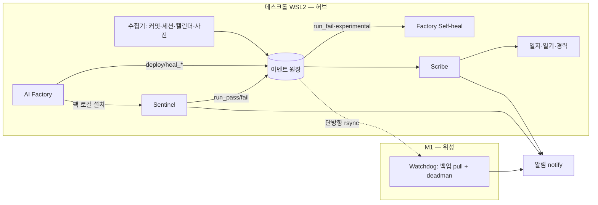

# 야간조(Night Crew) 통합 설계 v2.1 — 최종 구현판

> **v2.1 (2026-07-18):** DISCOVERY 검토에서 확정된 결함 7건 반영 — ① deadman 검사 대상을 어제→오늘(KST) 파일로 ② 감시견 백업에 artifacts 추가 ③ §7.2 설치 경로 이중 접두 오탈자 정정 ④ R3 다이제스트 참조 §8→§6 정정 ⑤ Self-heal 티켓 소스를 heal_request 단일 kind로 확정 ⑥ §0.1 표에 Watchdog 담당 추가 ⑦ mermaid 블로그 초안 제거. 상세 근거는 NIGHTCREW_DISCOVERY.md §B.

> **이 문서가 단일 진실이다.** 이전 초안(v1.1 M1-허브)·NIGHTCREW_BUILD_PLAN.md·ADDENDUM과 충돌하면 이 문서가 이긴다.
> BUILD_PLAN은 "값 채우기용 실행 런북"으로만 보조 참조한다.
> 구성요소는 서로를 직접 호출하지 않는다. 모든 결합은 4개의 계약(원장·팩·시그니처·알림)으로만 일어난다.
>
> **v2.0 확정 사항 (초안에서 뒤집은 것 3개):**
> 1. **허브 = 데스크톱(WSL2).** 원장·Scribe·Sentinel·Ollama·Factory·Self-heal 전부 데스크톱. M1은 위성(백업+감시견+iOS QA). 근거: love_place는 iOS(웹 Playwright 부적용), 데스크톱은 야간배치로 이미 24시간 가동, Ollama는 데스크톱 GPU. 메인 루프의 크로스머신 쓰기 0개.
> 2. **Sentinel은 love_place 리포가 아니라 nightcrew 리포에 산다.** 엔진은 배포 URL만 치면 되고(앱 소스 불필요), 멀티앱 팩 설치 대상이 특정 앱 리포일 수 없으며, protected 앱 코드에 자동화가 접근 금지라는 §12 원칙과도 정합.
> 3. **첫 팩 = Factory가 구운 토스(웹) 앱(experimental/smoke).** love_place는 iOS라 웹 Sentinel 대상이 아니다 — love_place QA는 M1 iOS 트랙(§9.3)에서 별도 설계.

---

## 0. 공통 프로토콜 — 어느 리포에서 열든 이 순서를 따른다

### 0.1 자기 위치 파악
리포 이름·README·폴더 구조를 근거로 아래 표에서 담당을 찾고, 판단 근거를 밝힌다. 확신이 없으면 추측하지 말고 사람에게 묻는다.

| 현재 리포 | 담당 컴포넌트 | 읽을 장 |
|---|---|---|
| **nightcrew** (신규) | 원장 유틸 + Sentinel 엔진/팩 + Scribe + notify + Watchdog 스크립트(M1에서 pull해 등록) | §2~§8, §10, §11 |
| **AI Factory** | Factory 훅 (팩 산출·설치·Self-heal 소비·이벤트 미러) | §2, §3, §4, §7 |
| love_place | **담당 없음** (읽기 전용 참고. 어떤 자동 수정도 금지) | — |
| 그 외 | 담당 없음 | 멈추고 사람에게 확인 |

### 0.2 탐색 먼저, 구현 금지
담당 장의 요구사항을 현재 코드베이스와 대조해 `NIGHTCREW_DISCOVERY.md`를 작성한다. 반드시 담을 것:
1. 끼워 넣을 정확한 지점(파일·함수·파이프라인 단계) 2. 예상 변경 규모·리스크 3. 이 설계와 충돌하는 현재 구조 4. 사람에게 물을 질문 5. 미정 환경값은 빈칸 표시.
예외: nightcrew 리포가 빈 리포면 DISCOVERY는 "생성할 디렉터리 구조 + §13 1주차 체크리스트"로 갈음한다.

### 0.3 멈추고 승인 대기
DISCOVERY 작성 후 반드시 멈춘다. 사람이 명시적으로 **"구현 승인"**이라고 말한 뒤에만 구현한다. 승인 시점은 §13 로드맵을 따른다.

---

## 1. 전체 그림

구성요소는 다섯이다.

- **이벤트 원장(Ledger)** — 밤새 모든 사건의 append 전용 기록. **데스크톱** `~/nightcrew/ledger/`. 이 시스템의 syslog.
- **Sentinel** — 배포된 앱을 새벽에 실사용해보는 Playwright QA 봇. nightcrew 리포. 엔진 하나, 앱은 팩으로 여럿.
- **Scribe(서기)** — 원장·커밋·일정·사진 메타를 읽어 개발일지·세 줄 일기·경력 원장을 쓰는 소비자. nightcrew 리포. (상세: SCRIBE_SPEC.md)
- **Factory 훅** — 앱을 구울 때 QA 팩을 함께 산출하고, Sentinel 실패를 Self-heal 티켓으로 소비. ai-factory 리포.
- **Watchdog(감시견)** — **M1 위성**. 원장 백업 pull + deadman 알림 + (후속) iOS QA. 유일하게 딴 기계여야 의미 있는 일들.



### 1.1 설계 원칙
1. **원장 중심.** 컴포넌트끼리 직접 호출 금지. 쓰는 쪽은 원장에 적립만, 읽는 쪽은 원장만 읽는다. 하나가 죽어도 나머지는 산다.
2. **순서 독립.** 각 컴포넌트는 다른 컴포넌트 없이 단독 동작한다. 원장이 없으면 기록만 건너뛰고 정상 동작.
3. **완성 우선.** 통합을 이유로 개별 컴포넌트 완성을 늦추지 않는다.

### 1.2 전역 공학 규칙 (실사고에서 승격 — 전 컴포넌트 강제)
- **R1 · env 부트 선행.** ESM에서 import 선언은 dotenv.config() "문장"보다 먼저 실행된다. 모듈-로드 시점에 env를 읽는 코드(DB 클라이언트 생성, 모델 상수 등)는 반드시 env 부트 모듈을 첫 import로 두거나 지연 읽기로 한다. *(.env에 DATABASE_URL이 있는데도 로컬 파일 폴백으로 가던 실사고, 2026-07)*
- **R2 · 기동 배너.** 모든 프로세스는 시작 시 "해석된 대상"을 1줄 출력한다: LEDGER_DIR 절대경로, DB URL(스킴+호스트, 쿼리스트링 제거), 알림 채널. *(push가 엉뚱한 DB에 적용되고도 "Changes applied"만 찍히던 유령 마이그레이션 실사고)*
- **R3 · 침묵 금지.** 건너뜀·파싱 실패·쓰기 실패는 반드시 카운트하고, 그 카운트를 일일 다이제스트(§6)에 노출한다. 조용한 catch-continue 금지. *(ensureSchema가 실패를 전부 삼켜 진단 불가였던 실사고)*

---

## 2. 계약 A — 이벤트 원장

### 2.1 위치와 형식
- 위치: **데스크톱** `$LEDGER_DIR` (기본 `~/nightcrew/ledger/`).
- 파일: 하루 한 파일 `YYYY-MM-DD.jsonl` (**KST 기준** 날짜 경계). JSON Lines, UTF-8, append 전용.

### 2.2 이벤트 스키마
```json
{
  "ts": "2026-07-18T03:12:44+09:00",
  "source": "sentinel",
  "app": "fac_fitcoach",
  "kind": "run_fail",
  "title": "결과 화면 미표시",
  "detail": "error_signature=fac_fitcoach:result:blank-screen",
  "refs": ["artifacts/fac_fitcoach/2026-07-18/03-r2.png"]
}
```
- `ts` ISO8601(+09:00) / `source` 기록 주체 / `app` 대상 앱(없으면 생략)
- `kind` 권장 어휘: `run_pass` `run_flaky` `run_fail` `heal_request` `heal_attempt` `heal_done` `deploy` `commit_digest` `session_digest` `heartbeat` `note`
- `title` 사람이 읽는 한 줄 / `detail` 짧은 부가정보 / `refs` 증거 경로·URL 배열
- 스키마 확장은 **additive만** 허용(필드 추가 OK, 의미 변경·삭제 금지).

### 2.3 쓰기 규칙 — 단일 관문 유틸 `ledger-append`
모든 쓰기는 nightcrew의 `collectors/ledger-append.mjs`(또는 동일 규약 구현)를 거친다:
- 입력: JSON 이벤트(인자 or stdin). 출력: 오늘 파일에 1줄. **flock**으로 append(동시 쓰기 안전).
- 검증: 필수 필드(`ts/source/kind`) 확인, 이벤트 **≤8KB**, `detail`·`title`에 시크릿 패턴(토큰/키 정규식) 발견 시 **거부**.
- `$LEDGER_DIR` 미설정 → 경고 1줄 + exit 0 (원칙 2). 쓰기 실패가 본 작업을 중단시키면 안 된다 — 자기 로그에 남기고 계속(단 R3: 실패 카운트).
- 시크릿·토큰·개인정보를 `detail`에 넣지 않는다. 증거는 `refs` 경로로만.
- **원격 머신에서 원장으로 push 금지.** 데스크톱에서 도는 프로세스만 직접 append. 예외 둘: ① M4 세션로그의 `store/inbox/` 파일 반입(파일 동기화이지 원장 append 아님) ② M1 iOS QA 결과의 ssh 경유 append 1회(반드시 ledger-append 유틸 경유).

### 2.4 읽기 규칙 + 소비자 커서
- 읽기 전용. 파싱 실패 줄은 건너뛰고 **개수를 센다**(R3 — 다이제스트에 노출).
- 소비자(Scribe·Self-heal)는 `store/cursors/{consumer}.json`에 `{file, line}` 커서를 유지해 **멱등 소비**한다. 같은 이벤트를 두 번 처리하지 않고, 프로세스 재시작에도 안전.

### 2.5 보존
- 원장 jsonl: 무기한(용량 미미). `artifacts/`: 30일 후 삭제(감시견 백업이 별도 보존).

---

## 3. 계약 B — 시나리오 팩

### 3.1 구조 (nightcrew 리포)
```
qa-sentinel/
  apps/
    {app_id}/
      pack.json
      scenarios/*.spec.ts
      fixtures/
  lib/  run.sh  ...   # 엔진 (앱 무관)
```

### 3.2 pack.json
```json
{
  "app_id": "fac_fitcoach",
  "name": "핏코치",
  "base_url_env": "FAC_FITCOACH_BASE_URL",
  "profile": "experimental",
  "level": "smoke",
  "created_by": "factory",
  "created_at": "2026-07-18"
}
```
- `profile`: `protected`(실사용자 있는 앱) | `experimental`(Factory 실험 앱). 동작 차이는 §11.
- `level`: `full`(전 과정) | `smoke`(렌더링 + 콘솔 에러 + 핵심 화면 도달만).
- `created_by`: `human` | `factory`. Factory 산출 앱의 `app_id`는 **`fac_` 접두 강제**.

### 3.3 엔진 규칙
- `apps/` 하위 `pack.json` 있는 폴더만 실행. 팩 간 격리(한 팩 실패가 다음 팩을 막지 않음).
- 실행 순서: `protected` 먼저, 그다음 `experimental`.
- 증거: `artifacts/{app_id}/{YYYY-MM-DD}/` + `result.json`(app_id 포함).
- base_url env 미설정 팩은 스킵하고 카운트(R3).

---

## 4. 계약 C — error_signature (신설)

- 형식: **`app_id:scope:slug`** (예: `fac_fitcoach:result:blank-screen`).
- `scope` = 화면/막(act) 식별자, `slug` = 소문자 케밥. **에러 메시지 텍스트를 slug에 넣지 않는다**(변동성 → 동일 원인이 매번 새 시그니처가 되는 것 방지). 화면·스텝 기반으로 안정적으로.
- **Sentinel만 생성한다.** Self-heal·Scribe·알림은 받은 시그니처를 그대로 echo만. (상한 카운트·중복 판정의 기준 키)

---

## 5. Sentinel v2 (nightcrew 리포)

- 엔진: Playwright. §3 규약. 스케줄: **04:30 KST** (야간배치 02:00 + quick 완료 후. 해당 앱 파이프라인이 아직 도는 중이면 그 팩은 스킵+카운트). **진행-중 마커 계약(v2.1 확정):** Factory가 파이프라인/힐 시작 시 `~/nightcrew/store/pipeline/{app_id}.json`에 `{"startedAt": ISO}`를 쓰고 종료 시 삭제한다. 엔진은 마커가 2시간 이내 신선할 때만 스킵(크래시 잔재가 팩을 영원히 막지 않게).
- 매 실행 종료 시 원장에 이벤트 1건 append: `run_pass`/`run_flaky`(재시도 후 성공)/`run_fail`. 실패면 `detail`에 error_signature(계약 C), `refs`에 대표 증거.
- **profile별 동작(§11 매트릭스가 원본):** `protected` = 재시도 → claude -p 보고 → 알림(사진+보고서). `experimental` = claude -p 분석 생략, 원장에 `heal_request` 발행(refs 포함), 알림은 실험 앱 묶음 한 줄 요약(§10 배칭).
- 매 새벽 실행 시작 시 `heartbeat` 이벤트 1건 append(감시견의 생존 신호).
- `.env`: `LEDGER_DIR`, 팩별 `*_BASE_URL`. 미설정으로도 동작(기록·해당 팩만 스킵). R1·R2 준수.
- **첫 팩**: 최신 배포된 Factory 토스 앱 1개(`fac_*`, smoke). love_place는 iOS — 웹 엔진 대상 아님(§9.3 트랙).

---

## 6. Scribe(서기) (nightcrew 리포)

Miner의 통합 확장. 상세 명세는 **SCRIBE_SPEC.md**가 원본이고, 여기엔 타 컴포넌트가 알아야 할 요지만:
- 구조: 수집기 4종(커밋, 캘린더, 세션 로그, 사진 메타) → `store/` 보관소 → 작가 3인(개발일지, 일기, 경력).
- 수집기는 §2 규약대로 `commit_digest`·`session_digest` 등을 append. 작가는 원장을 **읽기만**(§2.4 커서 규약).
- 커밋 수집은 `.env`의 `REPOS` **화이트리스트만**. 회사 리포 금지.
- **민감도 등급**: 개발일지·경력 = 어느 요약 엔진이든 가능. **일기·세션 로그 = 로컬 엔진(데스크톱 Ollama) 전용** — 로컬 엔진이 없으면 해당 작가는 대기. 원문 외부 전송 금지.
- 파일 반입 예외: M4 세션로그만 `store/inbox/` push 허용(집 와이파이 + 화이트리스트 경로만).
- 사람 입력 지점은 경력 원장의 확인 답장 하나뿐.
- 일일 다이제스트(아침 1줄 스탠드업)에 **R3 카운터**(파싱 실패 N, 스킵 N, 쓰기 실패 N)를 포함한다.

---

## 7. Factory 훅 (ai-factory 리포)

### 7.1 QA 팩 산출 (설계/검증 단계 확장)
- Spec이 이미 아는 핵심 기능에서 3~5개 막(act)을 뽑아 §3 규약 팩을 산출물에 포함.
- 기본 `level=smoke`. 이유: 앱인토스 토스 로그인·결제 브릿지는 외부 재현 불가 — 브릿지 의존 구간은 mock 응답 또는 화면 도달 확인까지만.
- `profile=experimental`, `created_by=factory`, `app_id=fac_*` 고정.
- DISCOVERY 힌트: spec 에이전트 산출물 생성부와 verification 산출물 목록이 삽입 지점. 기존 QA 에이전트·페르소나 랩(빌드 타임)과 역할이 다름을 문서화할 것 — Sentinel은 **배포 후 새벽 재검증**이다.

### 7.2 팩 설치 (배포 단계 확장)
- 배포 성공 시 팩을 **로컬 복사**로 `~/nightcrew/qa-sentinel/apps/{app_id}/`에 설치(같은 기계 — rsync 불필요. app_id는 이미 `fac_` 접두 포함 — 폴더명 = app_id 그대로). 설치 후 `kind=deploy` 이벤트 append.

### 7.3 Self-heal 소비 (`pnpm nightcrew:consume`, cron 15 * * * *)
- 원장에서 `kind=heal_request` + 해당 앱 `profile=experimental`인 이벤트만 티켓으로 소비(`run_fail`은 기록·통계용 — 동일 실패의 이중 티켓 방지). `refs` 증거(스크린샷·콘솔·네트워크)를 입력으로. 기존 `runSelfHeal()` 재사용.
- **heal_request 인터페이스(3주차 인수용, v2.1 확정):** `{ts, source:"sentinel", app, kind:"heal_request", title, detail:"error_signature=<대표 시그니처 1건>", refs:[스크린샷.png…, trace.zip…, playwright-report.json]}`. `refs`는 **nightcrew 리포 루트 기준 상대경로**(리포 밖이면 절대경로). 다건 실패의 전체 목록은 `artifacts/{app_id}/{date}/result.json`의 `signatures`·`specs`에 있다. trace.zip이 콘솔·네트워크 증거를 담는다.
- 수리 시도 `heal_attempt`, 완료·재배포 `heal_done` append. 별도 재검증은 만들지 않는다 — **다음 새벽 Sentinel이 자연 재검증**.
- **상한 3중**: ① 같은 error_signature 3회 연속 실패 → 자동 수리 중단 + 사람 에스컬레이션 ② 앱당 야간 2회 ③ 전체 야간 M회(기본 4).
- **디바운스**: 해당 앱 파이프라인/힐이 진행 중이면 보류. **사용량 가드**: 힐은 구독 창만 사용(API 현금 폴백 금지), 기존 NIGHTLY 예산·시간 상한 준수.
- 기존 겹침 정리(DISCOVERY 대상): `monitor` / `health-checker` / `post-deploy` 와 티켓 소스가 겹치지 않게 — Sentinel발 티켓은 `source=sentinel`로 구분.

### 7.4 이벤트 미러 (선택, 얇게)
- Factory의 기존 파이프라인 이벤트 중 `deploy`·`heal_*` 계열만 원장에도 append(emitEvent 훅에 1줄 어댑터, LEDGER_DIR 미설정 시 스킵). Scribe가 공장 활동을 일지에 포함할 수 있게 하는 유일한 다리.

### 7.5 금지
- Self-heal 수정 대상은 `experimental`(=`fac_*`) 앱 리포로 한정. **love_place 등 `protected` 앱 코드 접근 금지.** heal 직전 `pack.json`의 profile 재확인 후 아니면 hard-abort.

---

## 8. Watchdog(감시견) — M1 위성 (신설 장)

M1에 남는 일은 전부 "딴 기계여야만 의미 있는" 것들이다:
1. **백업**(07:30): `rsync -az desktop:~/nightcrew/ledger/ ~/nightcrew-backup/ledger/` + journal·artifacts 동일(§2.5의 "감시견 백업 별도 보존" 전제 충족). 단방향 pull. *단방향을 기술적으로 강제하려면 M1용 ssh 키를 데스크톱 authorized_keys에서 `command="rrsync -ro ~/nightcrew",restrict`로 제한할 것(예외 ②의 append용 키는 3주차에 별도 발급).*
2. **deadman**(08:00): 백업된 **오늘(KST) 파일**에 기대 이벤트(`heartbeat` 또는 `run_*` ≥1)가 없으면 알림(§10). *(04:30 heartbeat는 KST 경계상 오늘 파일에 기록되므로 — 어제 파일 검사는 다운을 24시간 늦게 잡는다. 오늘 파일 검사는 heartbeat 부재와 07:30 rsync 실패(파일 자체 부재)를 모두 당일 08:00에 잡는다.)* 데스크톱이 통째로 죽은 밤을 잡는 유일한 장치 — 감시 대상과 딴 기계라서 의미 있음. 자기 자신의 마지막 성공 시각을 로컬 마커로 남겨, 감시견이 조용히 죽는 것도 다음 실행이 알아챈다.
3. **iOS QA 트랙**(§9.3, 후속): love_place 배포 후 Xcode 시뮬레이터/실기기 Sentinel-iOS. 결과는 ssh 경유 ledger-append 1회(§2.3 예외 ②).

---

## 9. 미정/후속 트랙

- **9.1** KFS 실험 배치: 이 문서 범위 밖. 원장 형식만 공유 가능.
- **9.2** Scribe Phase 2(경력)·Phase 3(일기): §13 참조. Phase 3은 데스크톱 Ollama + Immich 준비 시.
- **9.3** Sentinel-iOS(love_place): 웹 Playwright 스펙 부적용 — 배포 후 별도 설계. 이 문서에서는 자리만 예약.

---

## 10. 계약 D — 알림(notify) 유틸 (신설)

- nightcrew 공용 `notify` 유틸 하나: 채널은 env로 선택 — `TELEGRAM_TOKEN`+`TELEGRAM_CHAT_ID`(기본) 그리고/또는 `SLACK_WEBHOOK_URL`(옵션).
- 실패해도 본 작업은 계속(R3 카운트). 미설정 시 콘솔 출력으로 폴백.
- **배칭**: experimental 실패는 건별 발송 금지 — 실행 종료 시 묶음 한 줄. protected 실패만 즉시 발송.
- Factory의 기존 Slack Block Kit 보고는 그대로 둔다(이 계약은 nightcrew 컴포넌트용).

---

## 11. 가드레일 매트릭스

| 항목 | protected (예: love_place) | experimental (fac_* 앱) |
|---|---|---|
| 실패 시 알림 | 즉시, 사진 + Claude 보고서 | 묶음 한 줄 요약 |
| claude -p 분석 | O (2연속 실패 시) | X (Self-heal이 분석) |
| 자동 수리 | **금지** (사람 결재) | 허용 (§7.3 상한 3중) |
| 앱 코드 수정 주체 | 사람 | Factory Self-heal |
| 재검증 | 사람 확인 후 | 다음 새벽 자동 |
| 테스트 수준 | full | smoke 기본 |
| 비용 | — | 구독 창만, API 현금 폴백 금지 |

---

## 12. 전역 금지 사항

- 원장에 시크릿·토큰·개인정보 기록 금지(관문 유틸이 스캔·거부).
- 컴포넌트 간 직접 호출 금지. 결합은 계약 A~D로만.
- `protected` 앱에 대한 어떤 자동 수정도 금지.
- 통합을 이유로 1주차 완성 지연 금지.
- 원장 스키마는 additive 변경만.
- 조용한 catch-continue 금지(R3).

---

## 13. 구현 순서 + 완성 기준

1. **1주차 — nightcrew 리포 부트스트랩.** 원장 유틸(ledger-append/read + 검증·flock·시크릿스캔) → notify 유틸 → Sentinel 엔진 + 첫 팩(fac_* 1개). *v2에서는 원장이 데스크톱 로컬이라 1주차에 바로 연결된다(순서 의존 제거).*
   완성 기준: `echo '{"ts":"...","source":"test","kind":"note","title":"hi"}' | node collectors/ledger-append.mjs` → 오늘 파일 1줄 / LEDGER_DIR 언셋 시 경고+exit 0 / Sentinel 수동 1회 → 원장 `run_*` 1건 + 시그니처 형식 확인 + artifacts 생성 / notify 미설정 시 콘솔 폴백.
2. **2주차 — Scribe Phase 1 + Watchdog.** 커밋 수집기 + 개발일지 작가(요약: claude, 로컬 준비되면 ollama 전환) + M1 rsync/deadman cron.
   완성 기준: `node scribe/daily.mjs` → `journal/오늘.md` 생성(R3 카운터 포함) / M1에서 rsync 성공 + 가짜 "빈 원장"으로 deadman 알림 발화 확인.
3. **3주차 — Factory 훅(§7).** 팩 산출 → 설치 → Self-heal 소비 → 이벤트 미러 순.
   완성 기준: 야간배치 1회에서 팩이 자동 설치되고, 다음 새벽 Sentinel이 그 앱을 돌고, 고의 결함 1개가 run_fail → heal_attempt → 다음 새벽 run_pass로 순환.
4. **수시 — Scribe Phase 2(경력, 반나절)·Phase 3(일기, Ollama·Immich 준비 시)·Sentinel-iOS(§9.3).**

---

## 14. 채울 값 (env)

| 값 | 어디 | 비고 |
|---|---|---|
| `LEDGER_DIR` | 데스크톱 전역 + nightcrew·factory `.env` | `~/nightcrew/ledger` |
| `TELEGRAM_TOKEN` `TELEGRAM_CHAT_ID` | nightcrew `.env` | notify 기본 채널 |
| `SLACK_WEBHOOK_URL` | (옵션) nightcrew `.env` | notify 보조 채널 |
| `REPOS` 화이트리스트 | nightcrew `.env` | 개인 리포만 |
| `FAC_*_BASE_URL` | nightcrew `.env` | 팩 설치 시 Factory가 안내 출력 |
| `OLLAMA_URL` | nightcrew `.env` | `http://localhost:11434` (데스크톱 로컬) |
| tailnet 이름 | 전역 | `desktop` / `m1` / `m4` (MagicDNS) |
| 집 WiFi SSID | M4 cron | 세션로그 동기화 게이트 |
| `NC_CLAUDE_BIN` | (선택) nightcrew `.env` | cron PATH에 claude가 없을 때 절대경로 |
| `NC_OLLAMA_MODEL` | (선택) nightcrew `.env` | 요약 모델, 기본 `llama3` |
| `NC_DESKTOP_HOST` `NC_DESKTOP_NIGHTCREW` `NC_BACKUP_ROOT` `NC_BACKUP_LEDGER_DIR` | (선택) M1 `.env` | 감시견 경로, 기본 `desktop`/`nightcrew`/`~/nightcrew-backup`(+`/ledger`) |

**결정 대기(빈칸):** ① 첫 팩으로 쓸 fac_* 앱 선정(첫 야간배치 성공작) ② love_place 웹 URL 존재 여부(있으면 protected 웹 팩 추가 가능) ③ 전체 야간 힐 상한 M(기본 4).
